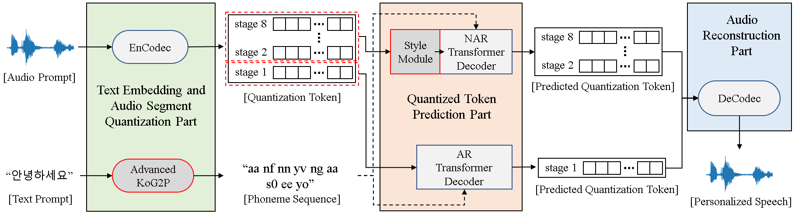

<p align="center">
</img>
</p>

# SC_VALL-E: Style-Controllable Zero-Shot Text to Speech Synthesizer based on VALL-E

This project was implemented using the unofficial PyTorch [implementation](https://github.com/enhuiz/vall-e) by "enhuiz".

You can check the audio demo of SC VALL-E at the following [link](https://0913ktg.github.io/).

You can read the paper on SC VALL-E at the following [link](https://arxiv.org/abs/2307.10550).

## Getting Started

Setting up the development environment for this project can be challenging due to version conflicts with various libraries. 

Therefore, we managed the development environment of this project using a Docker container. 

The Docker image, which can be used to create the Docker container, can be downloaded from [Docker Hub](https://hub.docker.com/r/0913ktg/vall-e/tags).

### Dataset

The data used for model training can be downloaded from the following link.

- 명령어 음성(일반남여) : https://aihub.or.kr/aihubdata/data/view.do?currMenu=115&topMenu=100&aihubDataSe=realm&dataSetSn=96
- 명령어 음성(소아,유아) : https://aihub.or.kr/aihubdata/data/view.do?currMenu=115&topMenu=100&aihubDataSe=realm&dataSetSn=95
- 명령어 음성(노인남여) : https://aihub.or.kr/aihubdata/data/view.do?currMenu=115&topMenu=100&aihubDataSe=realm&dataSetSn=94
- 자유대화 음성(일반남여) : https://aihub.or.kr/aihubdata/data/view.do?currMenu=115&topMenu=100&aihubDataSe=realm&dataSetSn=107
- 자유대화 음성(소아,유아) : https://aihub.or.kr/aihubdata/data/view.do?currMenu=115&topMenu=100&aihubDataSe=realm&dataSetSn=109
- 자유대화 음성(노인남여) : https://aihub.or.kr/aihubdata/data/view.do?currMenu=115&topMenu=100&aihubDataSe=realm&dataSetSn=108
- 감성 및 발화 스타일별 음성합성 데이터 : https://aihub.or.kr/aihubdata/data/view.do?currMenu=115&topMenu=100&aihubDataSe=realm&dataSetSn=466
- 한국인 외래어 발음 : https://aihub.or.kr/aihubdata/data/view.do?currMenu=115&topMenu=100&aihubDataSe=realm&dataSetSn=131
- 한국어 음성 : https://aihub.or.kr/aihubdata/data/view.do?currMenu=115&topMenu=100&aihubDataSe=realm&dataSetSn=123

### Installing

You can clone this GitHub repository and use it.

```
git clone https://github.com/0913ktg/SC_VALL-E
```

### Train

1. Put your data into a folder, e.g. `data/your_data`. Audio files should be named with the suffix `.wav` and text files with `.normalized.txt`.

2. Quantize the data:

```
python -m vall_e.emb.qnt data/your_data
```

3. Generate phonemes based on the text:

```
python -m vall_e.emb.g2p data/your_data
```

4. Customize your configuration by creating `config/your_data/ar.yml` and `config/your_data/nar.yml`. Refer to the example configs in `config/korean` and `vall_e/config.py` for details. You may choose different model presets, check `vall_e/vall_e/__init__.py`.

5. Train the AR or NAR model using the following scripts:

```
python -m vall_e.train yaml=config/your_data/ar_or_nar.yml
```

You may quit your training any time by just typing `quit` in your CLI. The latest checkpoint will be automatically saved.

### Export

Both trained models need to be exported to a certain path. To export either of them, run:

```
python -m vall_e.export zoo/ar_or_nar.pt yaml=config/your_data/ar_or_nar.yml
```

This will export the latest checkpoint.

### Synthesis

```
python -m vall_e <text> <ref_path> <out_path> --ar-ckpt zoo/ar.pt --nar-ckpt zoo/nar.pt
```

## Notice

- [EnCodec](https://github.com/facebookresearch/encodec) is licensed under CC-BY-NC 4.0. If you use the code to generate audio quantization or perform decoding, it is important to adhere to the terms of their license.

## Citation

```bibtex
@article{kim2023sc,
  title={SC VALL-E: Style-Controllable Zero-Shot Text to Speech Synthesizer},
  author={Kim, Daegyeom and Hong, Seongho and Choi, Yong-Hoon},
  journal={arXiv preprint arXiv:2307.10550},
  year={2023}
}
```

```bibtex
@article{defossez2022highfi,
  title={High Fidelity Neural Audio Compression},
  author={Défossez, Alexandre and Copet, Jade and Synnaeve, Gabriel and Adi, Yossi},
  journal={arXiv preprint arXiv:2210.13438},
  year={2022}
}
```

## Acknowledgments

* Hat tip to anyone whose code was used

There were many difficulties in processing the data downloaded from AI Hub for training. If you have preprocessed data available, it is recommended to use it as much as possible. However, if you plan to process data downloaded from the internet, be aware that data preprocessing can be time-consuming. 

Having a significant difference in the length of utterances in the training data can lead to inefficient training. It is recommended to use audio files with utterance lengths between 3 to 7 seconds.

* Inspiration

I would like to express my gratitude to [enhuiz](https://github.com/enhuiz) for providing well-implemented PyTorch source code. 

I also extend my thanks to [Moon-sung-woo](https://github.com/Moon-sung-woo) for providing valuable assistance in getting started with Expressive TTS.
